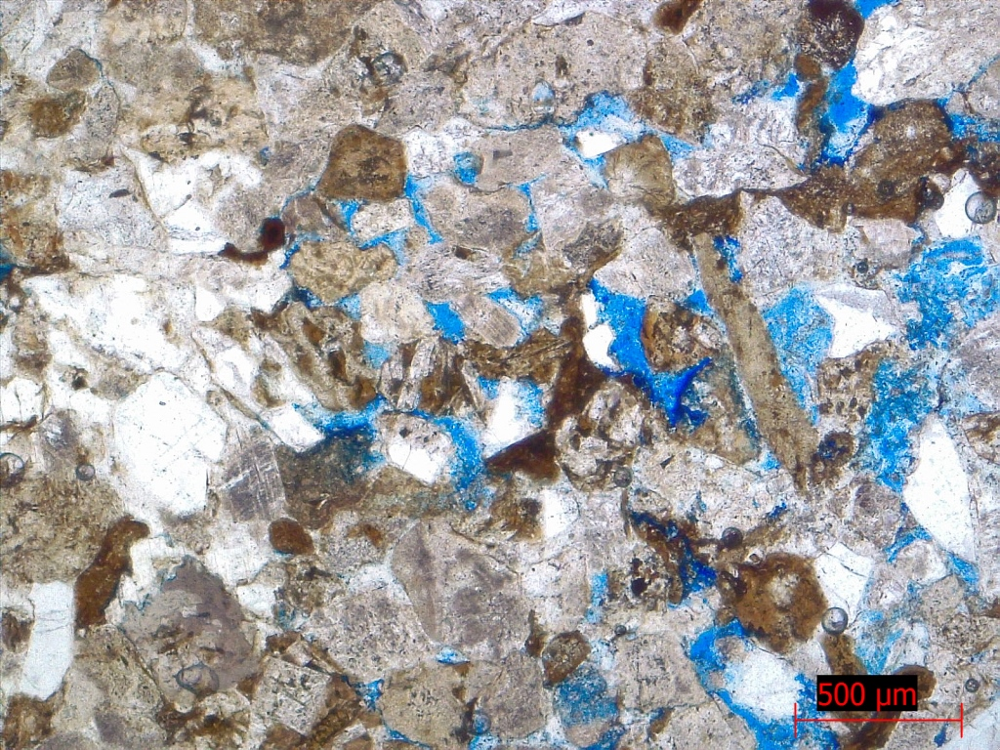
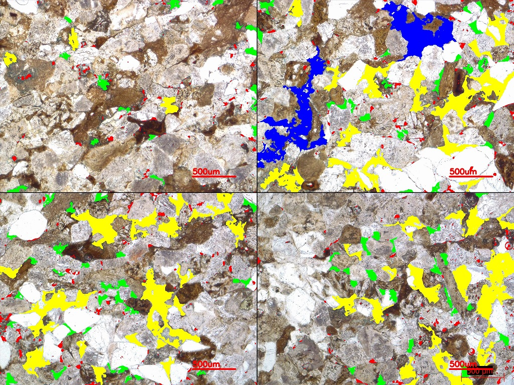

# Thin-Section-Porosity
This project application calculates the total porosity of a thin section and a histogram of pore sizes.
Thin Sections are 30 micron slices of rock used in Geology to describe the minerals present in the rock sample. In petroleum geology, calculating the porosity of a rock sample is important and is part of the routine geological analysis. During the preparation of the Thin Section, pores are filled with a blue resin that when photographed in a microscope, allows you to differentiate the pores from the rest of the minerals.

Usually four microscopic photographs are taken to have a more representative samplig of the thin section.

# Application
This program uses Tkinter library to make a GUI interface.
The pore area is calculated using opencv, with the following sequence:
1. Threshold the image into a binary file in the HSV color space using the HSV limits entered by the user (pores are white and minerals are black).
2. Find the contours of the pores in the binary image using findContours funtion from OpenCV.
3. Cycle through all the contours and for each contour (pore) draw it in a blank image and count the non-zero pixels, this gives the total pixels of the pore.
4. With the total pixels of the pore, calculate the diamter of the pore equating it to the area of the pore in pixels.
5. Multiply the Diameter by the scale to obtain diameter in microns.
6. Classify the pore diameter in the pore size histogram bins specified in the main program as a python list.
7. Add the area of the pore to the total area of the corresponding histogram bin.
8. Draw and fill the area of the pore in the composed color image with the corresponding to the pose color based on its size.
9. Once all the pores have been cycled, calculate the total porosity summing all the areas of the different bins and dividing by the total area of the image (multiply the shape  x and y of the composed image).
10. Then convert the total porosity and pore size histogram into pandas data frames and save them to a csv file with the name of the fourth image selected by the user.
11. Save the color image with all the pores filled with different colors for each pore size bin in the histogram.

# Using the application
Open the thin_section_porosity_zoom.py, and press **"Open Files"** and select four image files (they must have the same resolution), usually from diferent zones of the Thin Section, then modify the HSV color limits to threshold the blue zones that represent the Thin Section porosity.
Once the blue zones of the porosity are detected, press Calculate to get a report file that includes the calculation of the Total Porosity and a Histogram of the percentage of the porosity represented by the different pore sizes.
Pore Size Diameter is calculated as the diameter of a circle that has the same area as the total area of the pore.

# Example video

# Example results file

